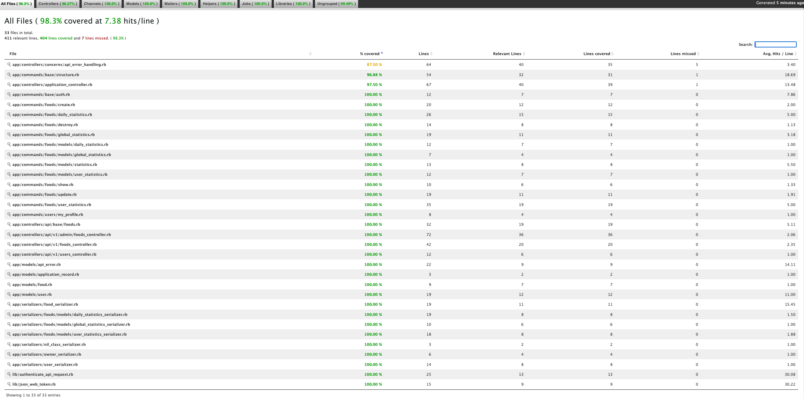

# Backend
- **Application**: Calorie Tracker
- **Author**: Mateusz Kiebala
- **Email**: mateuszkiebala@gmail.com
- **Server Technology**: Rails API
- **Database Technology**: MySQL

### Build setup
```
bundle exec rake db:create
bundle exec rake db:migrate
```

### Run locally
```
rails s
```
Server will be running at http://127.0.0.1:3000

### Run test
```
bundle exec rake test
```

Result:
```
Run options: --seed 23445

# Running:

..............................................................................................................

Finished in 0.991875s, 110.9011 runs/s, 295.4001 assertions/s.
110 runs, 293 assertions, 0 failures, 0 errors, 0 skips
```

Coverage:
